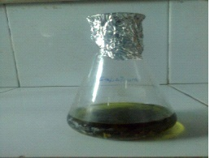
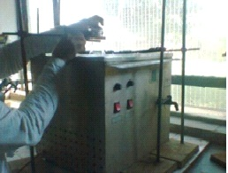
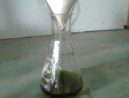
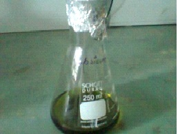
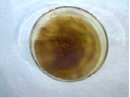

### Procedure

(a) Extraction of embelin from Tamarindus indica / Embelia ribes
<table>
  <tr>
    <td>
      

        Dried Embelia ribes / Tamarind (5gm) + Ethanol (100 ml)
      

    </td>
    <td width="150">
      
    </td>
  </tr>
  <tr>
    <td>
      

        Sonicated for 8 hrs
      

    </td>
    
  </tr>
  <tr>
    <td>
      

        Solvent extract
      

    </td>
    <td width="150">
      
    </td>
  </tr>
  <tr>
    <td>
      

          Filter
      

    </td>
   
  </tr>
  <tr>
    <td>
      

        Filtrate 
      

    </td>
    <td width="150">
      
    </td>
  </tr>
  <tr>
    <td>
      

        Rota vapour (Distillation under reduced pressure)
      

    </td>
    <td width="150">
      
    </td>
  </tr>
  <tr>
    <td>
      

        Crude extracts
      

    </td>
    <td width="150">
      
    </td>
  </tr>
</table>
(b) Qualitative and quantitative analysis of embelin

- A stock solution of embelin was prepared by dissolving embelin (5 mg) in chloroform (5 ml) in a volumetric flask. The solution was sonicated for 10 minutes over an ultrasonic bath, to obtain a homogenous solution.
- Embelin samples (tamarind, false black pepper, 5gm) were mixed with ethanol and sonicated for 6 hrs for proper mixing.
- The solution was filtered through Whatman No. 41 filter paper and filtrate was used as sample solution.
- A 20cm × 10cm aluminium backed HPTLC plate coated with silica gel
60 F 254 (E. Merck, Darmstadt, Germany) was used for analysis.
- The samples were applied at 10 mm from the base of HPTLC plate by means of a Camag (Switzerland) Linomat V sample applicator using a syringe (100µL, Hamilton, Bonaduz, Switzerland).
- A linear calibration curve was obtained on applying the increasing concentration of standard embelin in the range (200-1400 ng).
- HPTLC analysis was performed on a computerized densitometer scanner 3, controlled by winCATS planar chromatography manager version 1.4.4. (CAMAG, Switzerland)..
- Plate was developed to a distance of 80 mm, in a Camag twin-trough chamber with mobile phase [n-propanol: n-butanol: ammonia:: 7:1:4(v/v)].
- Plates were evaluated by densitometry at 200 nm with a Camag Scanner 3 for quantification.
