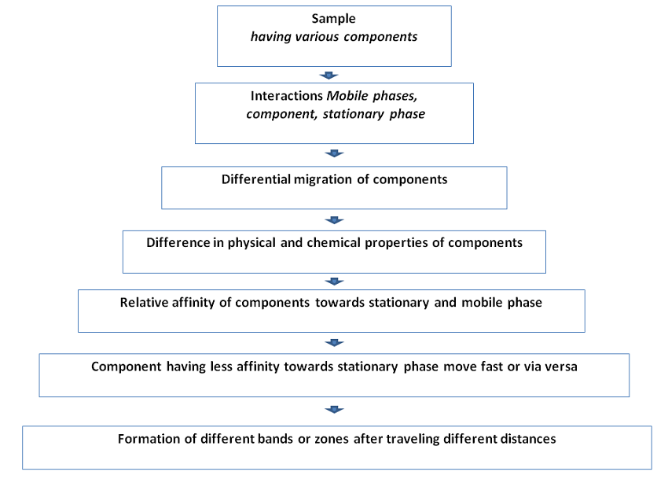

### HIGH PERFORMANCE THIN LAYER CHROMATOGRAPHY (HPTLC)
- HPTLC is an advanced and automated form of TLC that provides superior separation power and suitable for qualitative and quantitative analytical tasks.

- It is a flexible, versatile and economical process in which the various stages are carried out independently.

- It promotes for sample preparation requirements are often minimal, simultaneous processing of sample and standard, no prior treatment for solvents like filtration and degassing, higher separation efficiencies, shorter analysis time, less consumption of mobile phase, visual detection possible, efficient data acquisition and processing, low cost per analysis and low maintenance cost of the instrument.

- It is a valuable tool for reliable identification as it provides chromatographic fingerprints that can be visualized and stored as electronic images.
It has strong potentials as a substitute chromatographic model for estimating partitioning properties in support of combinatorial chemistry, environmental fate and health effect studies.

### PRINCIPLE OF HPTLC CHROMATOGRAPHIC SEPARATION

It relates with the conventional TLC Chromatographic separations

### RETARDATION FACTOR (Rf)

Rf is the characteristic feature of the each component and become the basis of qualitative separation. The retardation factor describes the ratio of time of the component spent in the stationary phase relative to the mobile phase.
Rf = Distance travelled by the solute (d1)
Distance travelled by the solvent (d2)

### FACTORS AFFECTING Rf VALUE

<table>
<tr>
<td width="60%">

- Polarity of solvent system
- Absorbent (types, grain size, water content, thickness)
- Amount of material spotted
- Temperature
- Solvent purity
- Saturation time of solvent chamber
- pH Acidic/Basic
- Humidity

</td>

<td width="40%">

</td>
</tr>
</table>
