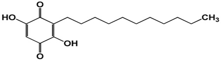

### Reagents

- Embelin standard
- Embelia ribes ( Kali mirch)
- Tamarindus indica ( Imli)
- Propanol
- Butanol
- Ammonia
- Ethyl alcohol

All chemicals used in this study must be of analytical grade.

Embelin, (2, 5-dihydroxy-3-undecyl-p-benzoquinone), is a naturally occuring alkyl substituted hydroxyl benzoquinone and produced by plants of the family Myrsinaceae. Quinones constitute one of the earliest known groups of naturally occurring organic compounds and are ubiquitous in nature. The major attraction was their color, but the recent interest in them is due to their biological activities (1). They are implicated in numerous cellular functions and are involved in mechanisms of electron and hydrogen transfers. Quinones form a large class of antitumour agents approved for clinical use, and many other antitumour quinones are in different stages of clinical and preclinical development (2).

Benzoquinones are the simplest representatives of quinone group. Embelin
(derivative of benzoquinone) is found to be the active principle of Embelia ribes. Embelin is a pharmacologically active substance and posses antifertility (3), analgesic (4), anthelmintic (5), antimicrobial (6), anti-inflammatory, antioxidant and antitumour properties (7).

Embelin has a long alkyl chain (undecyl) as a substituent, which confers solubility in the non-polar phase and cell permeability. The adjacent quinone and hydroquinone groups on embelin form intramolecular hydrogen bonds. It is insoluble in water and soluble in alcohol, chloroform and benzene.

### Observation

Use of pre-coated silica gel HPTLC plates with n propanol :n butanol : ammonia :: ,7: 1: 4 ,resulted in good separation of the embelin at 333nm (Rf = 0.68). The absence of additional peaks in chromatogram indicates non- interference of the common excipients used. Regression analysis of the calibration data for caffeine showed that the dependent variable (peak area) and the independent variable (concentration) were represented by the equations Y = – 191.213 + 2.518 x for embelin in Embelia ribes and tamarind. The correlation of coefficient (r2) obtained was 0.99971 shows a good linear relationship.

Fig. 1: Image at 254nm

Fig. 2: Image at 366 nm

Fig. 3: 3D view of Embelin in different samples

Fig. 4: Chromatogram for embelin

Fig. 5: Linearity graph for Embelin

### Results:

**Table 1: Quantification of the Embelin values in Samples**

| S. No. | Sample        | Amount of Embelin (mg/kg) |
|---------|--------------|---------------------------|
| 1       | Embelia ribes | 1.939                     |
| 2       | Tamarind      | 1.073                     |
